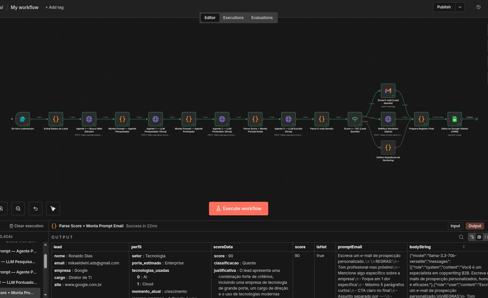
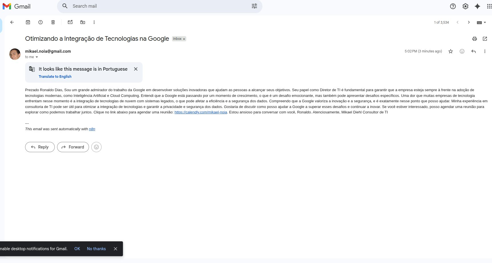
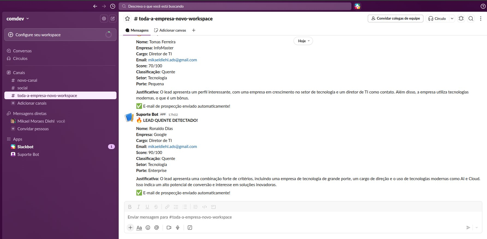
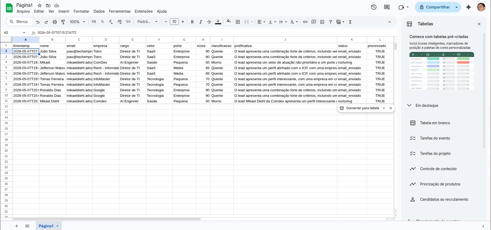
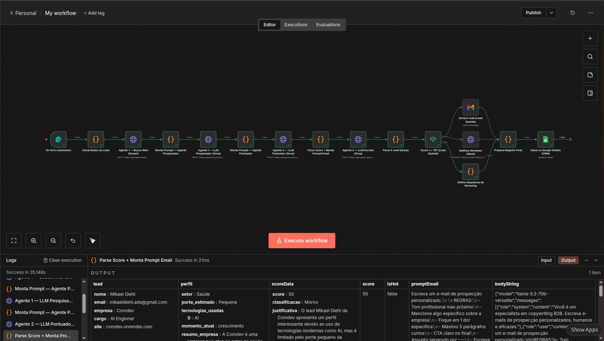

# 🤖 Lead Scoring Multi-Agente com IA — n8n + Groq + Serper

> Pipeline de qualificação automática de leads com 3 agentes de IA especializados: pesquisa, pontuação e redação de e-mail personalizado.

**Autor:** Mikael Diehl  
**Stack:** n8n · Groq (Llama 3.3 70B) · Serper API · Gmail · Slack · Google Sheets  
**Status:** ✅ Funcionando em produção

---

## 📋 Sobre o Projeto

Este projeto implementa um pipeline completo de lead scoring usando múltiplos agentes de IA orquestrados pelo n8n. Ao receber um lead via formulário, o sistema automaticamente pesquisa a empresa, gera um score de qualificação de 0 a 100, redige um e-mail de prospecção personalizado e — se o lead for quente (score ≥ 70) — envia o e-mail e notifica o vendedor no Slack. Todos os leads são registrados no Google Sheets como CRM.

### O que torna esse projeto especial

A separação em **3 agentes com responsabilidades distintas** é o padrão mais moderno em automações com IA. Cada agente faz uma coisa muito bem, e o n8n orquestra a sequência — exatamente como sistemas de IA enterprise funcionam.

---

## 🏗️ Arquitetura dos Agentes

```
Formulário (n8n Form)
        ↓
Extrai Dados do Lead
        ↓
Agente 1 — Pesquisador
Serper API busca empresa no Google
LLM extrai: setor, porte, tecnologias, momento, dores
        ↓
Agente 2 — Pontuador
LLM avalia fit com ICP e gera score 0-100
Critérios: setor, porte, cargo, momento, tecnologias
        ↓
Agente 3 — Escritor
LLM redige e-mail personalizado com contexto do lead
Assina como Mikael Diehl | Link Calendly incluído
        ↓
        IF score ≥ 70?
       ↙              ↘
   SIM (quente)     NÃO (frio)
     ↓                    ↓
Gmail + Slack        Nurturing
        ↓
Google Sheets (CRM)
```

---

## 🛠️ Pré-requisitos

| Serviço | Uso | Plano |
|--------|-----|-------|
| n8n | Orquestrador | Self-hosted (gratuito) |
| Groq | LLM — Llama 3.3 70B | Gratuito |
| Serper API | Google Search programático | 2.500 buscas/mês grátis |
| Gmail API | Envio de e-mails | Gratuito (OAuth2) |
| Slack | Notificação de leads quentes | Gratuito |
| Google Sheets | CRM / registro de leads | Gratuito |
| ngrok | Expor n8n local | Gratuito |

---

## 🚀 Instalação Passo a Passo

### 1. Configurar o n8n

```bash
npx n8n
```

Acesse em: `http://localhost:5678`

### 2. Configurar o ngrok

```bash
ngrok config add-authtoken SEU_TOKEN_AQUI
ngrok http 5678
```

### 3. Obter as chaves de API

**Groq:**
1. Acesse [console.groq.com](https://console.groq.com)
2. Vá em **API Keys → Create API Key**
3. Copie a chave (começa com `gsk_`)

**Serper:**
1. Acesse [serper.dev](https://serper.dev)
2. Crie uma conta e copie a API Key

**Slack Webhook:**
1. Acesse [api.slack.com/apps](https://api.slack.com/apps)
2. Crie um app → **Incoming Webhooks → Add New Webhook**
3. Copie a URL gerada

### 4. Configurar Gmail OAuth2 no Google Cloud

1. Acesse [console.cloud.google.com](https://console.cloud.google.com)
2. Crie um projeto (ex: `n8n-automacoes`)
3. Ative a **Gmail API** e **Google Sheets API** em Biblioteca
4. Crie credencial OAuth2 → Aplicativo da Web
5. Adicione URI de redirecionamento:
   ```
   http://localhost:5678/rest/oauth2-credential/callback
   ```
6. Em **Tela de consentimento → Público-alvo**, adicione seu e-mail como usuário de teste
7. Copie o **Client ID** e **Client Secret**

### 5. Criar a planilha CRM

1. Acesse [sheets.google.com](https://sheets.google.com) e crie uma planilha
2. Renomeie a aba para `Leads`
3. Copie o ID da URL:
   ```
   https://docs.google.com/spreadsheets/d/ID_AQUI/edit
   ```

### 6. Importar o Workflow no n8n

1. No n8n: **Workflows → Import from file**
2. Selecione `Lead_scoring_multi-agente.json`
3. Configure as credenciais:

| Nó | Campo | Valor |
|----|-------|-------|
| Agente 1 LLM Pesquisador | Authorization | `Bearer gsk_SUA_CHAVE_GROQ` |
| Agente 1 Busca Web | X-API-KEY | Sua chave do Serper |
| Agente 2 LLM Pontuador | Authorization | `Bearer gsk_SUA_CHAVE_GROQ` |
| Agente 3 LLM Escritor | Authorization | `Bearer gsk_SUA_CHAVE_GROQ` |
| Envia E-mail | Credential | Gmail OAuth2 configurado |
| Notifica Slack | URL | Webhook URL do Slack |
| Salva Google Sheets | Document | ID da sua planilha |
| Salva Google Sheets | Credential | Google Sheets OAuth2 |

4. Ative o workflow

---

## 🧪 Como Testar

O workflow usa um **n8n Form** como entrada. Acesse a URL do formulário gerada pelo n8n e preencha:

- **Nome completo**
- **Email**
- **Empresa**
- **Cargo**
- **Site da empresa**

Use empresas conhecidas para melhores resultados: Totvs, RD Station, Conta Azul, Google, etc.

---

## 🎯 Critérios de Pontuação (ICP)

| Critério | Pontuação |
|----------|-----------|
| Setor SaaS/Tech/Fintech | 25 pts |
| Porte Enterprise | 25 pts |
| Cargo C-Level/Diretor/VP | 20 pts |
| Momento Crescimento/Expansão | 15 pts |
| Tecnologias modernas | até 15 pts |

Score ≥ 70 → **Lead Quente** → e-mail enviado + alerta Slack  
Score < 70 → **Lead Frio** → entra em sequência de nurturing

---

## 📸 Demonstração

### Fluxo completo no n8n

Os 3 agentes processando um lead da Google com score 90:



### E-mail personalizado enviado automaticamente

E-mail gerado pelo Agente 3 com link do Calendly:



### Notificação no Slack

Alerta de lead quente com score, classificação e justificativa:



### CRM no Google Sheets

Todos os leads registrados automaticamente com score e status:



### Fluxo com lead frio (nurturing)

Lead com score 50 indo para sequência de nurturing:



---

## ⚙️ Personalização

### Alterar threshold de escalação
No nó **Score >= 70? (Lead Quente)**, mude o valor `70` para o threshold desejado.

### Alterar assinatura do e-mail
No nó **Parse Score + Monta Prompt Email**, edite a linha:
```
- Assine o e-mail com o nome "Mikael Diehl" e o cargo "Consultor de TI"
```

### Alterar link de agendamento
No mesmo nó, edite:
```
- Use exatamente este link de agendamento: https://calendly.com/SEU_USUARIO
```

### Alterar critérios do ICP
No nó **Monta Prompt — Agente Pontuador**, edite a seção `CRITÉRIOS DE PONTUAÇÃO` do `promptScore`.

---

## 🗂️ Estrutura do Projeto

```
.
├── README-lead-scoring.md
└── Lead_scoring_multi-agente.json
```

---

## 📄 Licença

MIT License — sinta-se livre para usar, modificar e distribuir.

---

*Desenvolvido por **Mikael Diehl***  
*Projeto de portfólio — n8n + Multi-Agente + IA*
